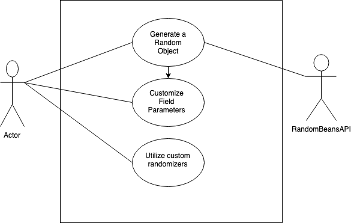

# Random Beans

## Project Abstract
Random beans is a Java library that allows programmers to generate randomized Java beans. Unlike java.util.Random which is limited to methods such as nextInt(), nextDouble(), nextFloat(), etc, EnhancedRandom API extends the Random library with nextObject which is far more versatile. Specifically, it allows you to randomize an instance or stream of any given object, and it's recursive implementation allows for multiple objects to be randomized with only one line of code, drastically reducing time required when testing. Furthermore, it allows specialized functions when randomizing for fields requirements, exclusion, and more.

A current issue that has been brought up for the project is the inability to specifiy field path when attempting exclude certain fields when randomly generated objects, the current FieldDefinition does allow you to specify fields of the same type in a recursive class structure.

**Example:**

```

A
  B b
  A a
   B b
   
```



## Project Relevance

The nature of working with a java library will strongly test understanding of Object Oriented Programming along with ability to debug problems and find heavily optimized solutions to maintain a clear and consise library. As this will be a major change in the API, maintaining current functionality of the library is a major goal. Along with this, TDD and Project Management are a large part of this project as well, as all implemented methods will need to have functioning tests to go along with it. Furthermore, as making changes to the API may cause various problems to currently working parts of the library, tracking new issues when implementing this solution will be crucial as well. 

## Conceptual Design

Currently, the contribution that I would like to make is two-fold. First, to find and implement a viable solution to the current limitations of the field exclusions when generating random java beans, along with a testing process for the implementation. Second, depending on the time available, work on resolving new issues that have been creating in the library in order to still keep the entirely library largely functioning as before. However, since the changes that are being made or being done at a fairly high level, this may not be able to be completed depending on the specific implementation created.   


## Background
https://github.com/benas/random-beans

## Required Resources
Strong understanding Java principles/OOP
